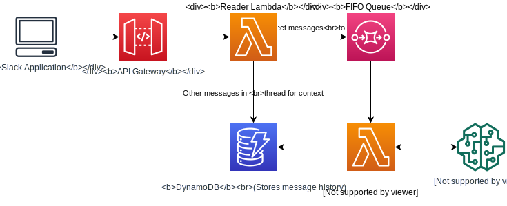
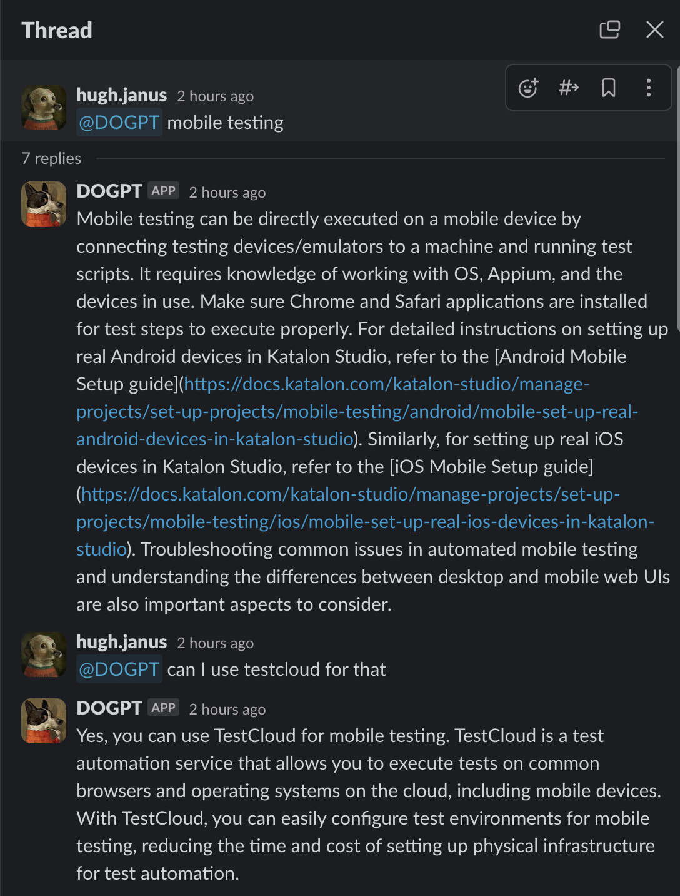

# langchain-aws-template

> Note
> This is a fork from [langchain-ai/langchain-aws-template](https://github.com/langchain-ai/langchain-aws-template)

This package contains source code to deploy LLM Slack bot built with LangChain to AWS. 

The package contains both the infrastructure (CDK code) and the application code to run the service

**[Slack Bot](./slack_bot)**: An API Gateway + Lambda based REST service, that can process slack messages by calling an LLM chain and retrieve documentation data from Pinecone, and send reply to the slack channel where the bot is installed.

## Prerequisites

- nodejs 18+

- Python 3.9+

- aws-cdk toolkit (`npm install -g aws-cdk`)

- AWS account configured with credentials (https://docs.aws.amazon.com/cdk/v2/guide/getting_started.html#getting_started_prerequisites)

- openai api key saved in Secrets Manager in your AWS Account

- Expected secret name is `slack-bot-secrets`

- openai key is expected to be stored with `openai-api-key` key

- conda (https://conda.io/projects/conda/en/latest/user-guide/install/index.html)
